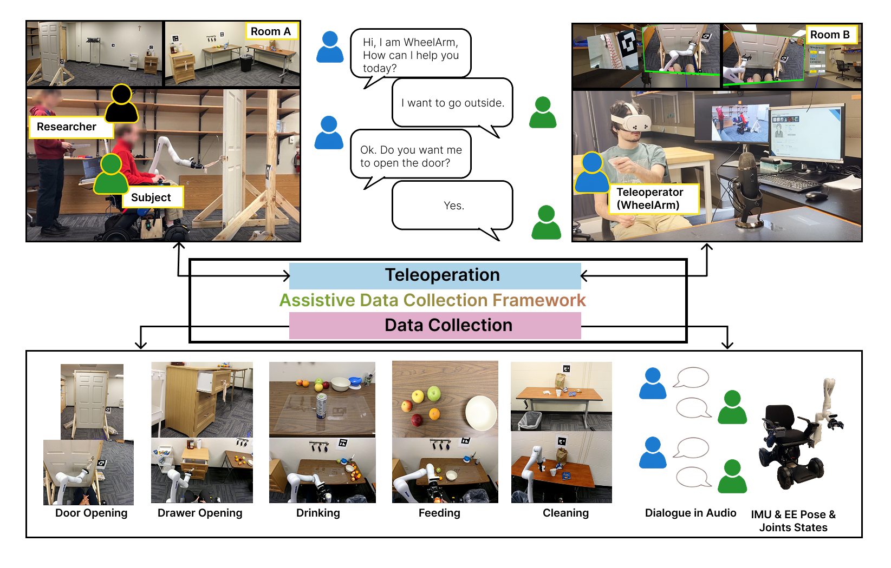

# A Multimodal Data Collection Framework for Dialogue-Driven Assistive Robotics to Clarify Ambiguities: A Wizard-of-Oz Pilot Study
Author: Guangping Liu, Nicholas Hawkins, Tipu Sultan, Flavio Esposito, Madi Babaiasl

Page: [project](https://madibabaiasl.github.io/WheelArmWoZDataset/) | Paper: [arxiv](https://arxiv.org/abs/2601.16870) | Code: [github](https://github.com/madibabaiasl/WheelArmWoZDataset) | Dataset: will be published soon

Welcome to the WheelArm Multimodel Dataset for the wheelchair and wheelchair-mounted robotic arm! In this research, we developed a real-time teleoperation and data collection framework using Wizard-of-Oz tailored for the Kinova Gen3 robotic arm and Whill Model CR2 wheelchair. Our work is developed on [OpenTeach](https://github.com/aadhithya14/Open-Teach) by customizing the Unity application, expanding the manipulation to navigation, and simplifying the hand detection to controller tracking. We propose a multimodal data collection framework that employs a dialogue-based interaction protocol and a two-room Wizard-of-Oz (WoZ) setup to simulate robot autonomy while eliciting natural user behavior. The framework records five synchronized modalities: RGB-D video, conversational audio, inertial measurement unit (IMU) signals, end-effector Cartesian pose, and whole-body joint states across five assistive tasks. Using this framework, we collected a pilot dataset of 53 trials from five participants and validated its quality through motion smoothness analysis and user feedback. The results show that the framework effectively captures diverse ambiguity types and supports natural dialogue-driven interaction, demonstrating its suitability for scaling to a larger dataset for learning, benchmarking, and evaluation of ambiguity-aware assistive control.

## Getting Started!
### Environment Setup

### ROS2 Packages Setup

### Program Setup

### Launch

## Dataset

## License

## Citation
